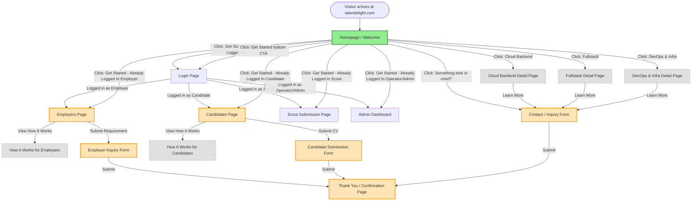

# TalenDelight User Navigation Flow

**Last Updated:** January 2, 2026  
**Status:** MVP - Homepage Complete with Smart CTA Routing, Other Pages Planned

---

## Combined User Navigation (Current State)



---

## Legend

- **🟢 Green (Solid):** Completed and live
- **🟡 Orange (Solid):** Planned for immediate development
- **⚪ Grey (Dashed):** Future enhancement

---

## Page Status

| Page | Status | Priority | Notes |
|------|--------|----------|-------|
| **Homepage / Welcome** | ✅ Complete | MVP | Live on local, ready for production |
| **Employers Page** | 🔄 Planned | High | Main landing for employer audience |
| **Candidates Page** | 🔄 Planned | High | Main landing for candidate audience |
| **Contact / Inquiry Form** | 🔄 Planned | High | Catch-all for "Something else in mind?" |
| **Employer Inquiry Form** | 🔄 Planned | Medium | May be embedded in Employers Page |
| **Candidate Submission Form** | 🔄 Planned | Medium | May be embedded in Candidates Page |
| **Thank You / Confirmation** | 🔄 Planned | Medium | Post-submission confirmation |
| Cloud Backend Detail | 📅 Future | Low | Detailed specialty pages (Phase 2) |
| Fullstack Detail | 📅 Future | Low | Detailed specialty pages (Phase 2) |
| DevOps & Infra Detail | 📅 Future | Low | Detailed specialty pages (Phase 2) |
| How It Works (Employers) | 📅 Future | Low | May be section within Employers Page |
| How It Works (Candidates) | 📅 Future | Low | May be section within Candidates Page |

---

## Navigation Patterns

### Primary User Journeys

**Employer Journey:**
```
Homepage → I'm an Employer → Employers Page → Inquiry Form → Thank You
```

**Candidate Journey:**
```
Homepage → I'm a Candidate → Candidates Page → Submit CV Form → Thank You
```

**Uncertain Visitor Journey:**
```
Homepage → Something else in mind? → Contact Form → Thank You
```

---

## Next Diagrams to Create

1. **Employer-Specific Navigation** - Detailed flow for employers only
2. **Candidate-Specific Navigation** - Detailed flow for candidates only
3. **Admin/Backend Navigation** - WordPress admin workflows (future)

---

## Notes

- Homepage has **6 clickable CTAs** total (2 in hero, 4 in specialties, 2 in final CTA)
- All specialty boxes currently link to "#" (placeholders)
- "Something else in mind?" is the catch-all for uncertain visitors
- Forms may be embedded in pages or standalone, depending on implementation

---

## Updates

| Date | Change | Author |
|------|--------|--------|
| Dec 31, 2025 | Initial navigation diagram created | System |
| Dec 31, 2025 | Homepage marked as complete | System |
